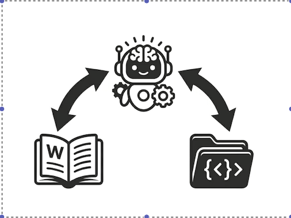

# SimpCode — High-Integrity Agentic Engineering Assistant

<p align="center">
  
</p>

SimpCode is not just another coding assistant. It is a **task-oriented orchestrator** designed to automate complex engineering missions while maintaining absolute architectural truth.

Unlike chat-indexed tools that get lost in large codebases, SimpCode builds a persistent **Semantic Wiki** of your project. It treats your codebase as a structured knowledge graph, ensuring that every line of code it writes is grounded in your project's unique patterns and constraints.

---

## The Quick Start

Install SimpCode globally and prepare for your first mission:

```bash
# 1. Install system-wide
curl -sSL https://raw.githubusercontent.com/fahadazizz/simpcode/main/install.sh | bash

# 2. Configure your LLM (Anthropic, OpenAI, Groq, Google, etc.)
simp setup

# 3. Onboard your project
cd /path/to/your/repo
simp init

# 4. Start a task
simp do "Implement a robust retry logic for the API client"
```

---

## Why SimpCode?

The modern bottleneck isn't typing—it's **context management**. SimpCode solves this through three core pillars:

### 1. The Semantic Wiki (.simp/wiki)
Standard assistants "grep and guess." SimpCode maintains a repository-local long-term memory. It distillates source code into cognitive nodes, allowing for **zero-hallucination navigation** of complex logic.

### 2. Explicit Implementation Plans
We follow a **"Think-Before-Type"** philosophy. SimpCode never modifies your code without first presenting a detailed Markdown plan. You review the strategy, approve the targets, and watch the execution.

### 3. Policy-Driven Engineering (AGENT.md)
Your project has unwritten rules. Put them in `AGENT.md`. SimpCode reads these rules at the start of **every** turn, ensuring it follows your style guide, naming conventions, and testing requirements to the letter.

---

## Main Interface

| Command | Goal | Description |
| :--- | :--- | :--- |
| `simp ask` | **Research** | Perform deep forensic queries using the Semantic Wiki. |
| `simp do` | **Action** | Full Engineering Lifecycle: Research -> Plan -> Approve -> Execute -> Sync. |
| `simp chat` | **Pairing** | High-fidelity interactive TUI for real-time collaboration. |
| `simp sync` | **Audit** | Re-sync the Wiki after manual changes or large merges. |
| `simp setup` | **Config** | Global credential management (~/.simpcode/config.json). |

---

## Documentation

For deep-dives into our architecture and advanced workflows, visit our [Documentation Portal](docs/index.md):

- **[Installation Guide](docs/getting-started/installation-deep-dive.md)**
- **[Concepts & Architecture](docs/concepts/index.md)**
- **[The ReAct Loop](docs/concepts/index.md#the-engineering-lifecycle-the-react-loop)**
- **[Writing High-Quality Rules](docs/how-to/writing-rules.md)**
- **[CLI Reference](docs/reference/index.md)**

---

## Security & Privacy

- **Local Analysis**: Your code is indexed and analyzed locally. Only relevant snippets and wiki nodes are sent to your provider for reasoning.
- **Hardened Harness**: SimpCode uses a secure execution layer with shell-escaping and permission gates to prevent unauthorized operations.
- **Privacy-First**: No data is sent to SimpCode's servers; we talk directly to your chosen AI provider's API.

---

## Contributing

We build for engineers, by engineers. Check out our [Architecture Overview](docs/architecture/index.md) to see how you can extend the core, build new wiki engines, or add support for more LLM providers.

---
<p align="center">
  <i>"SimpCode isn't just an assistant; it's a junior engineer who never sleeps and remembers every function you've ever written."</i>
</p>
