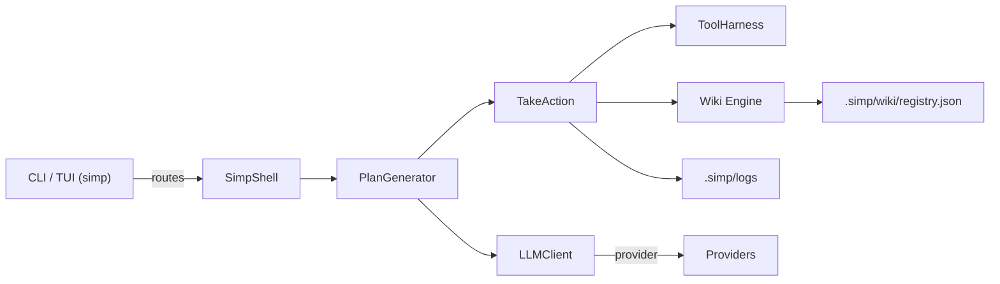

# Architecture Deep Dive — User + Engineer View

This document explains SimpCode internals at two levels:

- User-focused behavior and guarantees (what you can expect when using `simp`).
- Implementation pointers for engineers who want to inspect or modify the code.

Use the Quick Navigation below to jump to the area you care about.

## Quick Navigation

- [User guarantees & behavior](#user-guarantees--behavior)
- [High-level component map](#high-level-component-map)
- [Where to find implementation](#where-to-find-implementation)
- [Wiki engine details & performance guarantees](#wiki-engine-details--performance-guarantees)
- [Executor & verification behavior](#executor--verification-behavior)
- [Operational notes for teams](#operational-notes-for-teams)

---

## User guarantees & behavior

These are the runtime guarantees SimpCode provides to users and reviewers:

- Plan approval: No writes occur without an approved plan (unless you explicitly use `--yes`).
- Scoped writes: The executor enforces a write scope derived from the plan; writes outside the scope are blocked.
- Deterministic verification: After a write, the executor runs deterministic verification commands (linters, unit tests) when provided.
- Inspectable artifacts: Plans, sessions, logs, and wiki pages are persisted under `.simp/` for auditing.

If your usage model depends on different guarantees, define them in your team conventions and encode them in onboarding and plan review steps.

---

## High-level component map

---

## Where to find implementation

- CLI and TUI routing: `src/simpcode/cli/main.py`, `src/simpcode/cli/shell.py`
- Planner: `src/simpcode/core/planner.py` (structured output and ArchitectResponse parsing)
- Executor/TakeAction: `src/simpcode/core/executor.py`
- Tool harness and safety: `src/simpcode/harness/tools.py`, `src/simpcode/harness/permissions.py`
- Wiki engine: `src/simpcode/wiki/engine.py`, `src/simpcode/wiki/models.py`, `src/simpcode/wiki/index.py`
- Index Manager: `src/simpcode/core/generator.py` and `src/simpcode/wiki/index.py`
- LLM adapters: `src/simpcode/core/llm/*` (openai, anthropic, google, etc.)
- State, logs, and execution artifacts: `src/simpcode/core/state.py`

---

## Wiki engine details & performance guarantees

Behavioral summary:

- The wiki engine maintains an inverted registry mapping source file paths to wiki page IDs in `.simp/wiki/registry.json`.
- `get_pages_for_file(file_path)` performs an O(1) dictionary lookup against the registry — this is the fast path used during execution and sync.
- `save_page(page)` attempts to remove only prior source mappings by using a private metadata attribute `_previous_sources` when present; this makes cleanup proportional to the number of sources for that page (O(s)).
- As an edge case, if `_previous_sources` is not available (page loaded from disk without metadata), `save_page` falls back to scanning the registry (O(m)). This is rare and only used to maintain correctness.
- `get_all_pages()` caches results using the wiki directory mtime to avoid full rescans when nothing changed.

Why this matters:

- Lookups for pages impacted by a file change are constant-time (O(1)).
- Saving a page that references a small number of sources will scale with the number of sources, not the total number of pages.

---

## Executor & verification behavior

- The executor derives an explicit write scope from the approved plan and blocks operations outside that scope.
- After each write/patch, the executor runs `flake8 <file>` and then the step-specific `verification` command if provided.
- All steps, tool calls, stdout/stderr, and verification results are appended to a JSONL trace in `.simp/logs/exec_<session>.jsonl`.

Engineering pointers:

- Look at `TakeAction.execute` in `src/simpcode/core/executor.py` and `ToolHarness` in `src/simpcode/harness/tools.py` for exact enforcement logic.

---

## Operational notes for teams

- Use `--dry-run` for high-risk tasks and require a code-review style approval before executing real writes.
- Prefer small, deterministic verification commands so the executor yields consistent results.
- When onboarding a repository, accept that the first run may perform more scanning and synthesis; iteration stabilizes indexed artifacts.
- Keep `.simp/` in your review/backup scope for auditability; treat it as a first-class project artifact.

---

If you need sequence diagrams, deploy/emergency runbooks, or a tailored architecture doc for a specific integrator (CI, internal model provider), I can add those next.
